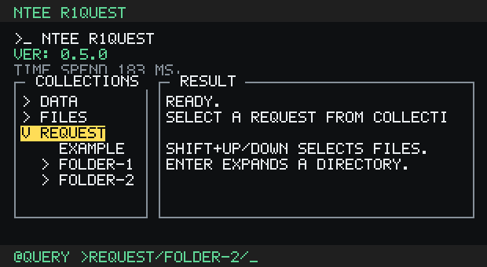

# ntee-r1quest

`ntee-r1quest` is a small terminal HTTP request runner. Requests are written in
`.nts` files, reusable data is written in `.ntd` files, and macros connect the
two.



## Usage

### 1. Install Node.js

`ntee-r1quest` runs on Node.js. Check that Node is available before running it:

```bash
node --version
```

This project targets Node.js 24 or newer.

### 2. Run with npx

After the package is published, run the terminal UI with:

```bash
npx ntee-r1quest
```

Use `-r` to choose the request root directory:

```bash
npx ntee-r1quest -r ./example
```

Inside the terminal UI, type a request file name without the `.nts` extension:

```text
@default >request/example
```

Nested paths are supported:

```text
@default >folder/request-name
```

### 3. Link locally and run `r1q`

For local development, install dependencies, build the compiled JavaScript, and
link the package:

```bash
npm install
npm run build
npm link
```

Then run the CLI command from any directory:

```bash
r1q
```

Or run it with an explicit request root:

```bash
r1q -r ./example
```

When installed or linked, the package name is `ntee-r1quest`, but the CLI command
is `r1q`.

### 4. Run the bundled examples

You can also clone the repo and run the app against the bundled `example`
directory:

```bash
npm install
npm run build
npm run start
```

`npm run start` runs the compiled app from `dist/index.js` with `example` as the
request root.

Try:

```text
@default >request/example
```

or the file upload example:

```text
@default >request/example-upload
```

After a response is rendered, switch to search mode with:

```text
@default >@search
```

Then type a search query to highlight matching response text:

```text
@search >content-type
```

Return to request mode with `@q` or `@default`:

```text
@search >@q
```

The example files are:

```text
example/data/example.ntd
example/data/example-upload.ntd
example/files/example.txt
example/request/example.nts
example/request/example-upload.nts
```

## Request File Declaration

### `.ntd` definition files

`.ntd` files hold reusable definition data. Request files can load this data
with `ref` and read values with `@i(key)`.

Example:

```ntd
host: "https://jsonplaceholder.typicode.com"
content-type: application/json
token: @env(API_TOKEN)
enabled: true
age: 2
tags: ["api", "example"]
profile: {
  name: "r1quest"
}
```

Supported value types:

- string
- number
- boolean
- null
- array
- object
- `@env(KEY)` environment variable macro

Caution points:

- Wrap URLs in double quotes. Unquoted `http://` or `https://` contains `//`,
  which starts a comment.
- Bare values default to strings unless they are `true`, `false`, `null`, or a
  number.
- Keys may be bare identifiers such as `content-type`, or quoted strings when
  needed.
- `.ntd` files can use `@env(KEY)`, but they cannot use `@i(...)` or `@f(...)`.

Good:

```ntd
host: "https://httpbin.org"
```

Problematic:

```ntd
host: https://httpbin.org
```

### `.nts` request files

`.nts` files declare one HTTP request. They can include references, a URL, a
method, headers, authorization, and an optional body.

Example:

```nts
ref ../data/example.ntd

url "@i(host)/todos/1"
type get

header accept, @i(content-type)
header content-type, @i(content-type)
```

Supported declarations:

- `ref ./path/to/file.ntd`
- `url "https://example.com/path"`
- `type get`
- `header content-type, application/json`
- `auth bearer token`
- `authorization basic token`
- `body ...`

References:

```nts
ref ../data/example.ntd
```

`ref` must appear before the other request statements. The path is resolved
relative to the `.nts` file.

URL:

```nts
url "@i(host)/post"
```

The URL declaration expects a quoted string. You can interpolate `@i(...)`
macros inside the string.

Method:

```nts
type post
```

Common HTTP methods such as `get`, `post`, `put`, `patch`, and `delete` are
supported.

Authorization:

```nts
auth bearer @i(token)
```

or:

```nts
authorization basic @i(credentials)
```

Headers:

```nts
header accept, application/json
header content-type, @i(content-type)
```

Header keys are normalized to lowercase at compile time. Header macro values
must resolve to primitive values: string, number, boolean, or null.

JSON object body:

```nts
body {
  name: "r1quest"
  enabled: true
  tags: ["api", "example"]
}
```

JSON array body:

```nts
body [
  { name: "first" },
  { name: "second" }
]
```

Plain text body:

```nts
body "plain text body"
```

Multiline text body:

```nts
body "line one
line two
line three"
```

Multipart file upload body:

```nts
ref ../data/example-upload.ntd

url "@i(host)/post"
type post

header content-type, @i(content-type)

body {
  name: "r1quest"
  file: @f(../files/example.txt)
}
```

Caution points:

- `@f(...)` is only valid inside request body values.
- `@f(...)` takes a literal file path. It does not take an `@i(...)` macro as
  its path.
- File paths in `@f(...)` are resolved relative to the `.nts` file.
- `ref` paths are resolved relative to the `.nts` file.
- Comments start with `//`.

## Macros

### `@i(key)`

`@i(key)` reads a value from referenced `.ntd` definition data.

Use it in `.nts` files:

- quoted URL strings
- authorization credentials
- header values
- body values
- plain text/bare string interpolation

Example:

```ntd
host: "https://httpbin.org"
content-type: application/json
```

```nts
ref ../data/example.ntd

url "@i(host)/post"
type post

header content-type, @i(content-type)
```

`@i(...)` is not supported inside `.ntd` files.

### `@env(KEY)`

`@env(KEY)` reads an environment variable.

Use it only in `.ntd` files:

```ntd
token: @env(API_TOKEN)
```

Then reference it from `.nts` with `@i(...)`:

```nts
ref ../data/auth.ntd

url "https://api.example.com/me"
type get

auth bearer @i(token)
```

If the environment variable is missing, compilation throws an error.

### `@f(path)`

`@f(path)` loads a local file as a request body value.

Use it only in `.nts` body values:

```nts
body {
  file: @f(../files/example.txt)
}
```

For form uploads, set the request content type to multipart form data:

```nts
header content-type, multipart/form-data
```

Caution points:

- `@f(...)` cannot be used in headers or authorization.
- `@f(...)` cannot be used as the entire body by itself.
- `@f(...)` paths are literal paths, not macros.
- File paths are resolved relative to the `.nts` file.

## Examples

The repo includes a GET example using JSONPlaceholder:

```text
example/data/example.ntd
example/request/example.nts
```

It also includes a multipart upload example using httpbin:

```text
example/data/example-upload.ntd
example/request/example-upload.nts
example/files/example.txt
```

Run them with:

```bash
npm run build
npm run start
```

Then type:

```text
@default >request/example
```

or:

```text
@default >request/example-upload
```
